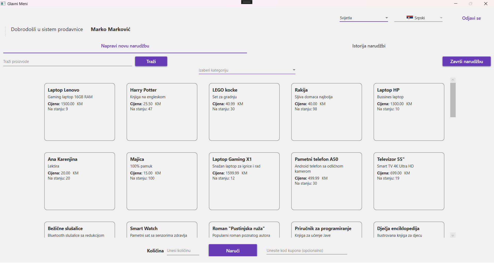
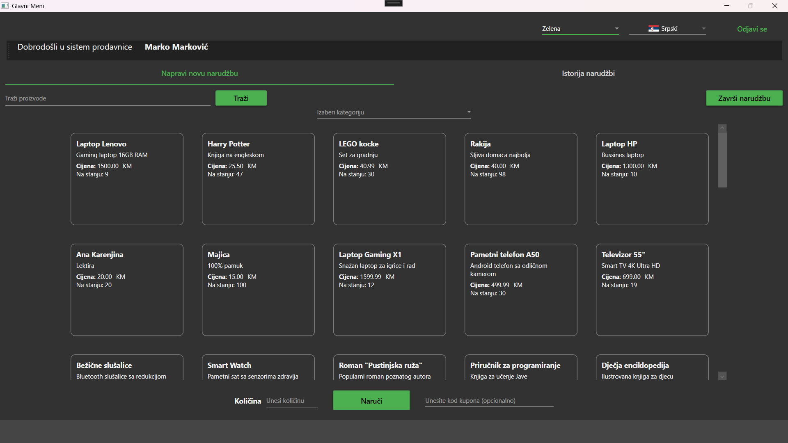
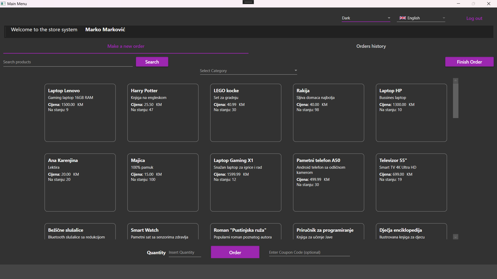
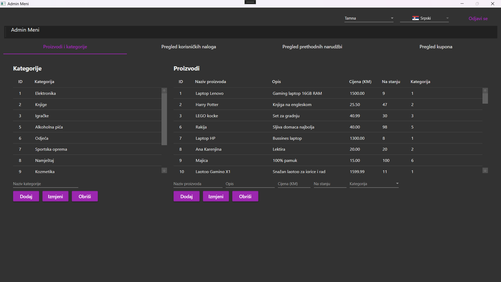
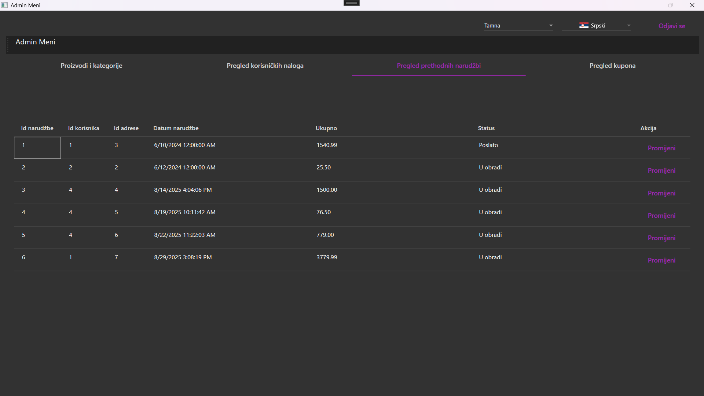
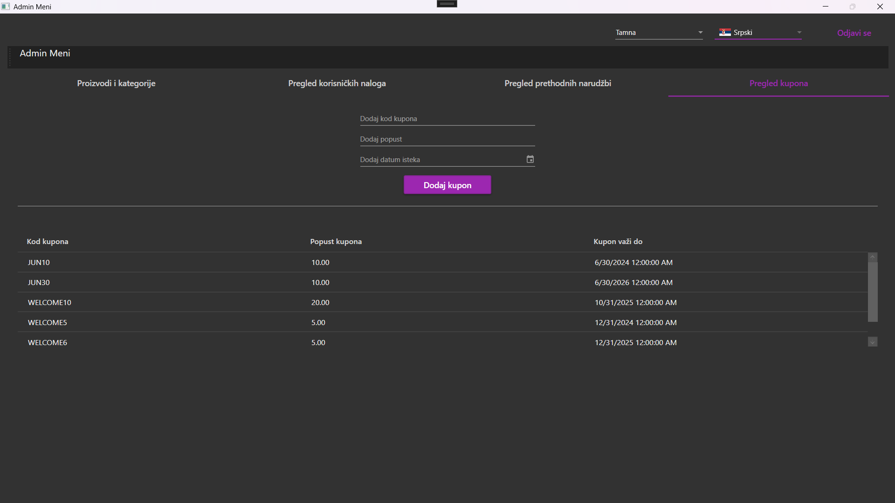

#  ProdavnicaApp - WPF Aplikacija za Upravljanje Prodavnicom

##  Sadržaj
- [O aplikaciji](#o-aplikaciji)
- [Prijava na sistem](#prijava)
  - [Registracija na sistem](#registracija)
- [Prozor za običnog korisnika](#prozor-za-obicnog-korisnika)
  - [Odabir teme i jezika](#odabir-teme-i-jezika) 
  - [Naručivanje proizvoda](#narucivanje-proizvoda)
  - [Pregled prethodnih narudžbi](#istorija-narudzbi)
- [Prozor za admina](#prozor-za-admina)
  - [Proizvodi i kategorije](#proizvodi-i-kategorije)
  - [Pregled korisničkih naloga](#korisnicki-nalozi)
  - [Pregled prethodnih narudžbi](#prethodne-narudzbe)
  - [Pregled kupona](#kuponi)

##  O aplikaciji

ProdavnicaApp je desktop aplikacija napisana u WPF (Windows Presentation Foundation) koja omogućava upravljanje online prodavnicom. Aplikacija podržava dve uloge korisnika: **kupac** i **administrator**, sa različitim funkcionalnostima za svaku ulogu. Sastoji se od 3 glavna prozora: prozor za prijavu, prozor za običnog korisnika (kupca) i prozor za admina.

### Ključne karakteristike
- **Dvojezičnost**: Podržava srpski i engleski jezik
- **Material Design**: Moderan i intuitivan korisnički interfejs
- **Baza podataka**: MySQL integracija sa Entity Framework
- **Responsive dizajn**: Prilagođava se različitim veličinama prozora

##  Prijava na sistem

Korisnik se prijavljuje na sistem tako što unosi svoje podatke za prijavu.

     

Ukoliko podaci nisu ispravni izbacuje se greška.

    

###  Registracija na sistem

Ukoliko korisnik nema nalog, može da se registruje.

    

Pri regisraciji korisnik mora da unese validne podatke, pravilan format e-maila, lozinke, kao i ponovljena lozinka.

      
      
    

##  Prozor za običnog korisnika (kupca)

Korisnik kada se prijavi na sistem, prikazuje mu se glavni korisnički prozor na kojem može da napravi narudžbu.

     

###  Odabir teme i jezika

Korisnik može da izabere u gornjem desnom ćošku željenu temu i jezik, čiji se izbor čuva za datog korisnika sljedeći put kada se prijavi na sistem.

    
    

Na sljedećim slikama prikazan je korisnički prozor u svijetloj temi i zelenoj.

    
    

Na sljedećoj slici prikazan je korisnički prozor na engleskom.

    

###  Naručivanje proizvoda 

Korisnik može da filtrira željene proizvode po odabiru kategorije, da ukuca ime proizvoda ili njegov opis.

     
     
    

Filtriranje po kategoriji:

    

Filtriranje po kucanju ključnih riječi:

    

Kada korisnik odabere neki proizvod koji želi da naruči treba da upiše količinu proizvoda koju želi da naruči u odgovarajućem tekst boksu.

    

Kada izabere količinu proizvod se dodaje u korpu i ispisuje se odgovarajuća poruka na status baru.

    

Ukoliko nije dostupna količina proizvoda ispisaće se odgovarajuća poruka na status baru.

    

Prije nego što završi narudžbu korisnik može da unese odgovarajući kupon kod koji bi mu dao određeni popust.

    

Korisnik kada odabere sve proizvode koje želi da naruči, da završi narudžbu bira odgovarajuće dugme za završetak narudžbe, nakon koje se otvara prozor za potvrdu narudžbe na kojem se nalaze detalji narudžbe.

     
    

Kada korisnik potvrdi narudžbu otvara se prozor za unos adrese narudžbe, nakon unosa otvara se prozor za odabir načina plaćanja.

     
    

Nakon uspješnog plaćanja dobija se odgovarajuća poruka sistema.

    

###  Pregled prethodnih narudžbi

Korisnik ima uvid u svoje prethodne narudžbe.

    

Korisnik može da odabere neku narudžbu, nakon čega se otvara prozor koji prikazuje detalje te narudžbe.

    

##  Prozor za admina

Admin meni nudi niz opcija od kojih je podrazumijevana dodavanje, uređivanje i brisanje proizvoda i kategorija. 

###  Proizvodi i kategorije

    

Admin može da izabere kategoriju ili proizvod koji želi da promijeni ili obriše klikom na odgovorajući podatak u listi. Takođe, isto može da uradi kucanjem u tekst box ili ako želi da doda neku novu kategoriju ili proizvod.

    
  

###  Pregled korisničkih naloga

Admin ima i uvid u sve korisničke naloge i njihove osnovne podatke.

    

###  Pregled prethodnih narudžbi

Admin ima uvid u sve narudžbe svih korisnika gdje može da mijenja status narudžbe klikom na odgovarajuću narudžbu.

    
    
    

Kada promijeni status narudžbe, sistem šalje odgovarajuću poruku.

    

###  Pregled kupona

Admin ima i mogućnost pregleda svih kupona koje korisnici mogu da koriste da bi dobili određeni popust, kao i dodavanje istih.

    
     
    

Nakon dodavanja kupona, sistem šalje odgovarajuću poruku.

    

